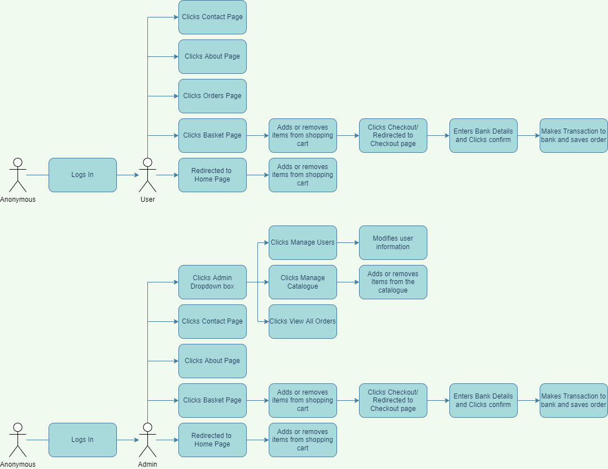
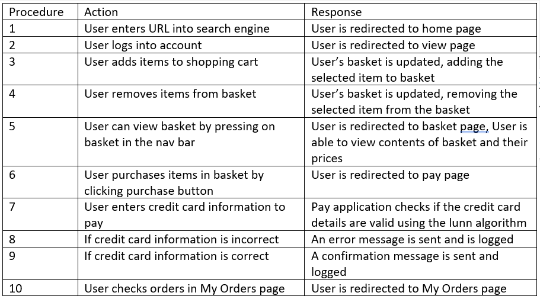
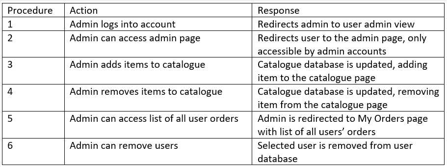
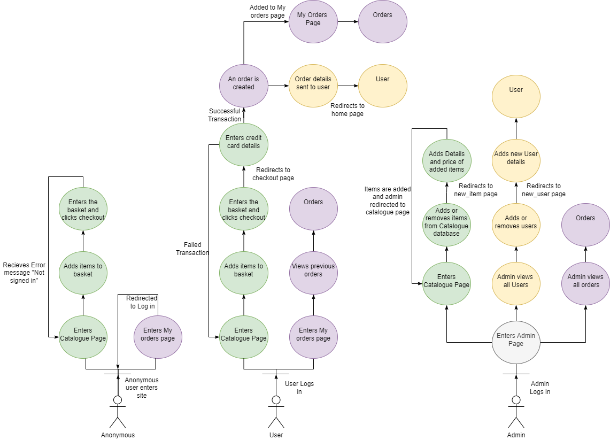
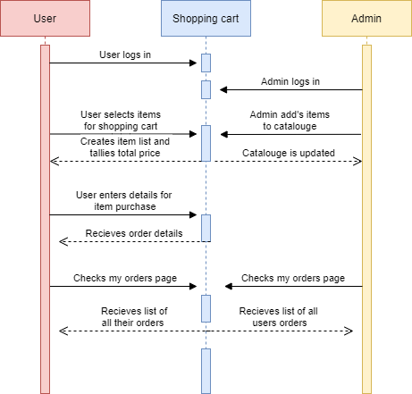
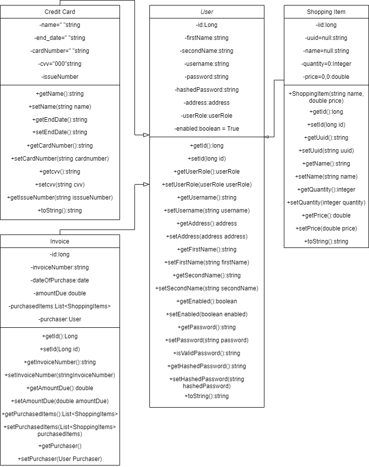
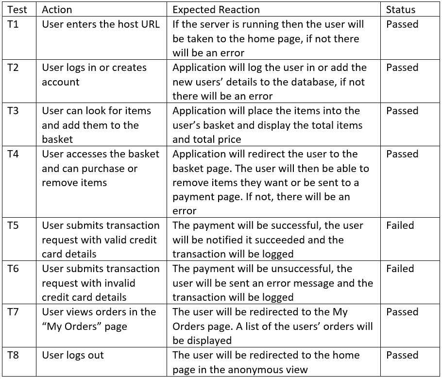
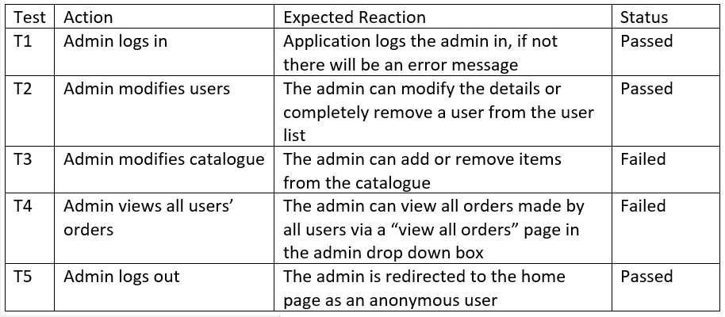

# COM528_AE2

## Running the Application
To run the application, all that needs to be done is to unzip the shopping cart application, open the application in netbeans, build and clean the application and then right click on the web module and run. If the clean and build step doesn't work, open windows powershell in the file directory of the application and run the command mvn clean intall. 

## Use Case Diagram
Use case diagrams are made before the start of a project, displaying the main requirments of the system and showing the main interactions between the system and the actors in order to show how the system runs in order to write the application. Below is a use case diagram designed for the admin and user, showing the differences in the way they interact with the system. 

## Use Cases
Below is the use cases in a table format, the action being what the user does and the response being the output from the system. There is a use case for both the user and the admin below.

## Robust Diagram
A robustness diagram displays how the actors interact with differnet objects within the system, showing how the actors interact with the interface and controllers. Below is the robustness diagram for the User, Anonymous User and Admin.

## Sequence Diagram
A sequence diagram displays the interaction of the users with the system in a sequencial order, showing off the processes of the system in order and helping to better understand how the flow of information among the application works. The sequence below shows how the admin and the user interact with the shopping cart application.

## Model
The model diagram below shows a graphical look on the object orientation taking place within the shopping cart application, showing how the classes, attributes and methods work and how their relationships work within the system. This helps create a better understanding when implementing the application.

## Test Plan
The test plan is a table designed before testing the implemented application. The expected result is tested and if the expected result isnt recieved then the test is failed. The test plan should cover almost every aspect of the system, the test plans below cover the different function of the user and admin.

